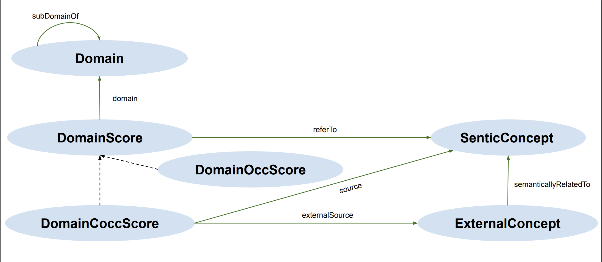

# DomainSenticNet

<i>DomainSenticNet</i>, is an extension for the <i>OntoSenticNet</i> ontology which integrates each of the original 100,000 concepts in <i>OntoSenticNet</i> with a set of semantically related concepts, and domain distributional information.  
In particular, we mined semantically related concepts from the <i>WordNet</i> and <i>Probase</i> knowledge bases, while we compute domain distributional information using textual descriptions from the entire collection of domain-specific crowdfunding campaigns in Kickstarter.

Used in combination with <i>OntoSenticNet<i>, our resource can favor the development of novel hybrid Aspect-based Sentiment Analysis systems and research on Sentic Computing in domain-aware applications.

<i>DomainSenticNet</i> ontology scheme.

# Datasets 

<i>Release ver. 0.1 of June 2020</i>

- domain distributional information for the concept "apple" (across 176 domains):
 https://github.com/needindex/domainsenticnet/blob/master/domainsenticnet_apple_june_2020.zip

- domain distributional information for the 100K concepts   (across 2 domains i.e., <i>Games</i> and <i>Mobile games</i>):
https://github.com/needindex/domainsenticnet/blob/master/domainsenticnet_mobile_games_june_2020.zip

<i>upcoming Release ver. 1.0 </i>

- domain distributional information for the 100K concepts   (across 176 domains):
  avaliable on summer/fall 2020.

# License
The related resources are publicly available under <i>Attribution 4.0 International (CC BY 4.0)</i>. https://creativecommons.org/licenses/by/4.0/deed.en

# Authors
...
